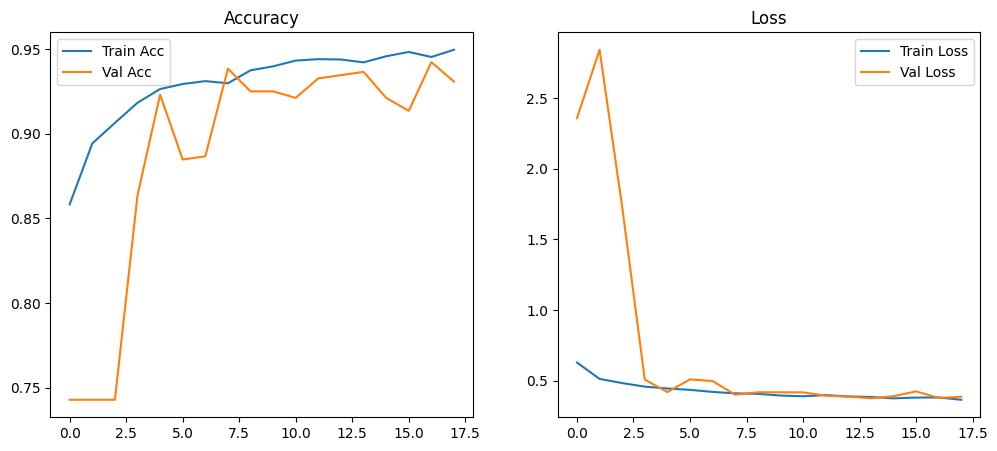
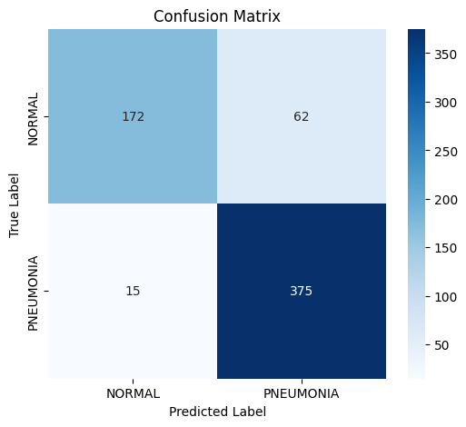
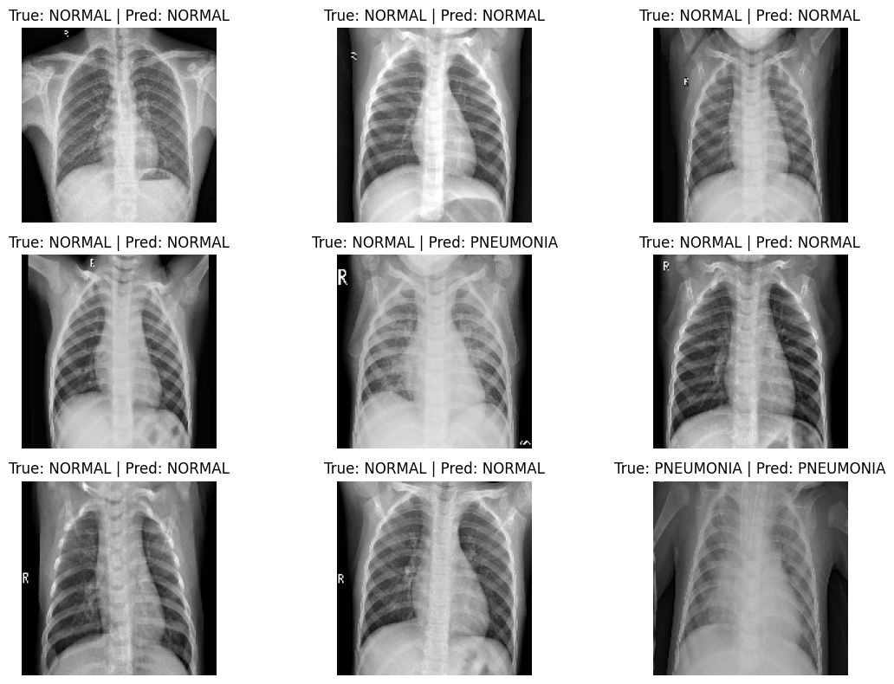

# 🩺 Chest X-ray Pneumonia Detection using CNN


[](YOUR_STREAMLIT_APP_URL_HERE)
## 🧠 Overview
This project uses **Convolutional Neural Networks (CNN)** to detect **Pneumonia** from **Chest X-ray images**.  
By leveraging deep learning, the model classifies X-ray images as **Normal** or **Pneumonia**, providing an efficient tool to assist medical diagnosis — especially in areas with limited radiology resources.

---

## 📑 Table of Contents
- [Motivation](#motivation)
- [Dataset](#dataset)
- [Approach](#approach)
- [Model Architecture](#model-architecture)
- [Evaluation Metrics](#evaluation-metrics)
- [How to Run](#how-to-run)
- [Results](#results)
- [Try the Live Demo](#try-the-live-demo)
- [Folder Structure](#folder-structure)
- [Future Improvements](#future-improvements)
- [References](#references)

---

## 💡 Motivation
- Pneumonia remains one of the leading causes of death worldwide, particularly among children and the elderly.  
- Detecting pneumonia through X-rays requires expert radiologists, which are not always accessible.  
- This project aims to automate pneumonia detection using CNNs, enabling faster and more consistent diagnostics.

---
## 📂 Dataset
- **Source:** [Chest X-Ray Images (Pneumonia) - Kaggle Dataset](https://www.kaggle.com/datasets/paultimothymooney/chest-xray-pneumonia)

- **Structure:**
```
├── chest_xray_dataset/
│   └── chest_xray/
│   │   ├── test/
│   │   │   ├── NORMAL/
│   │   │   └── PNEUMONIA/
│   │   ├── train/
│   │   │   ├── NORMAL/
│   │   │   └── PNEUMONIA/
│   │   └── val/
│   │       ├── NORMAL/
│   │       └── PNEUMONIA/
│   │──── test/
│   │      ├── NORMAL/
│   │      └── PNEUMONIA/
│   ├──── train/
│   │     ├── NORMAL/
│   │     └── PNEUMONIA/
│   └──── val/
│         ├── NORMAL/
│         └── PNEUMONIA/
```
- **Total Images:**
  - Train: 5,216 (Normal: 1,341, Pneumonia: 3,875)
  - Validation: 16 (Normal: 8, Pneumonia: 8)
  - Test: 624 (Normal: 234, Pneumonia: 390)

- **Preprocessing:**
  - Images resized to 150×150 pixels     
  - Pixel normalization (rescale = 1/255)     
  - Data augmentation (rotation, flip, zoom)   
  - Note: The training notebook dynamically applies a 10% validation_split to the original training data to create a larger, more robust validation set (~521 images).


---

## ⚙️ Approach
1. **Data Preprocessing:** Using Keras `ImageDataGenerator` for augmentation and normalization.  
2. **Class Balancing:** Utilized class weights in the model fit function to counter the dataset imbalance.
3. **Model Design:** Built a CNN from scratch using TensorFlow/Keras.  
4. **Training:** Tuned hyperparameters for optimal accuracy without overfitting.  
5. **Evaluation:** Used metrics such as accuracy, precision, recall, and F1-score.  
6. **Visualization:** Plotted accuracy/loss curves and confusion matrix for analysis.

---

## 🧩 Model Architecture

| Layer | Type | Output Shape | Parameters | Activation |
|-------|------|--------------|-----------|-----------|
| 1 | Conv2D | (None, 148, 148, 32) | 896 | ReLU |
| 2 | MaxPooling2D | (None, 74, 74, 32) | 0 | - |
| 3 | BatchNormalization | (None, 74, 74, 32) | 128 | - |
| 4 | Conv2D | (None, 72, 72, 64) | 18,496 | ReLU |
| 5 | MaxPooling2D | (None, 36, 36, 64) | 0 | - |
| 6 | BatchNormalization | (None, 36, 36, 64) | 256 | - |
| 7 | Conv2D | (None, 34, 34, 128) | 73,856 | ReLU |
| 8 | MaxPooling2D | (None, 17, 17, 128) | 0 | - |
| 9 | BatchNormalization | (None, 17, 17, 128) | 512 | - |
| 10 | Dropout | (None, 17, 17, 128) | 0 | - |
| 11 | Flatten | (None, 36992) | 0 | - |
| 12 | Dense | (None, 128) | 4,735,104 | ReLU |
| 13 | Dropout | (None, 128) | 0 | - |
| 14 | Dense | (None, 1) | 129 | Sigmoid |

**Loss Function:** Binary Crossentropy  
**Optimizer:** Adam  
**Learning Rate:** 5*10^-5(0.00005)  
**Epochs:** 20  
**Batch Size:** 32  
**Total Parameters:** 4,829,377  
**Trainable Parameters:** 4,828,929  
**Non-Trainable Parameters:** 448

---

## 📈 Evaluation Metrics
- **Accuracy**
- **Precision**
- **Recall**
- **F1-Score**
- **Confusion Matrix**
- **ROC Curve (AUC)**

---

## ▶️ How to Run
1. **⚙️ Initial Setup & Environment Creation**
- **Clone the repository**
```bash
git clone https://github.com/SourabhKhamankar22/Chest-xray-Pneumonia-detection-using-CNN.git
cd Chest-xray-Pneumonia-detection-using-CNN
```
- **Create the Environment**
 Use the provided environment.yml to build the compatible stack (Python 3.9, TF 2.10, locked NumPy).
```bash
conda env create -f environment.yml
```
- **Activate the Environment:** You must run all subsequent commands within this activated environment.
```bash
conda activate tf-gpu
```

2. **📂 Data Preparation & Training**
- **Place the Dataset:** Download [Chest X-Ray Images (Pneumonia) - Kaggle Dataset](https://www.kaggle.com/datasets/paultimothymooney/chest-xray-pneumonia) and ensure the main data folder (chest_xray_dataset/chest_xray/) is placed inside your cloned repository.

- **Train the Model:** Run the notebook to generate the model weights and verify GPU connectivity.
```bash
jupyter notebook pneumonia_detection.ipynb
```
***(Run all cells to generate models/pneumonia_model.h5.)***

3. **🚀 Launch the Application**
Once the model is trained, launch the interactive demo:
- Launch Streamlit:
```bash
streamlit run app.py
```
***(The application will open automatically in your web browser.)***

4. **Steps performed in the notebook:**

  - **Load and preprocess dataset**
  - **Build CNN model**
  - **Train and validate**
  - **Evaluate performance**
  - **Visualize results**

## 📊 Results

- Achieved **91.36% validation accuracy** and **89.26% test accuracy**
- Model generalizes well on unseen test images
- **Classification Report on Test Set:**
  - **NORMAL:** Precision 0.88 | Recall 0.81 | F1-score 0.84 | Support 234  
  - **PNEUMONIA:** Precision 0.89 | Recall 0.93 | F1-score 0.91 | Support 390  
- **Overall Metrics:** Accuracy 0.88 | Precision 0.88 | Recall 0.88 | F1-score 0.88
- **Confusion Matrix & ROC Curve** demonstrate strong discriminative ability
- Training and validation curves show stable convergence with minimal overfitting

## 🌐 **Try the Live Demo:** [Chest X-ray Pneumonia Detector](YOUR_STREAMLIT_APP_URL_HERE)
 
## 🖼 Visualizations
- **Accuracy & Loss Curves:**  
  
- **Confusion Matrix:**  
  
- **Sample predictions on test images (Normal vs Pneumonia)**  
  

## 🗂 Folder Structure
```bash
├── chest_xray_dataset/
│   └── chest_xray/
│   │   ├── test/
│   │   │   ├── NORMAL/
│   │   │   └── PNEUMONIA/
│   │   ├── train/
│   │   │   ├── NORMAL/
│   │   │   └── PNEUMONIA/
│   │   └── val/
│   │       ├── NORMAL/
│   │       └── PNEUMONIA/
│   │──── test/
│   │      ├── NORMAL/
│   │      └── PNEUMONIA/
│   ├──── train/
│   │     ├── NORMAL/
│   │     └── PNEUMONIA/
│   └──── val/
│         ├── NORMAL/
│         └── PNEUMONIA/
├── images/
├── models/
│   └── pneumonia_model.h5
├── .gitignore
├── app.py
├── environment.yml
└── pneumonia_detection.ipynb
```

## 🚀 Future Improvements

  - **Implement Transfer Learning (e.g., ResNet50, DenseNet, EfficientNet)**
  - **Use cross-validation to improve robustness**
  - **Add Grad-CAM visualization for model interpretability**
  - **Deploy model as a web app (using Streamlit or Flask)**
  - **Train with larger and more diverse datasets**

## 📚 References

  - **Kaggle: Chest X-Ray Images (Pneumonia)**
  - **TensorFlow & Keras Documentation**
  - **Related research on Pneumonia detection using deep learning**


## Author: [Sourabh Khamankar](https://github.com/SourabhKhamankar22)

  🎯 Deep Learning | Medical Imaging | CNN | TensorFlow
